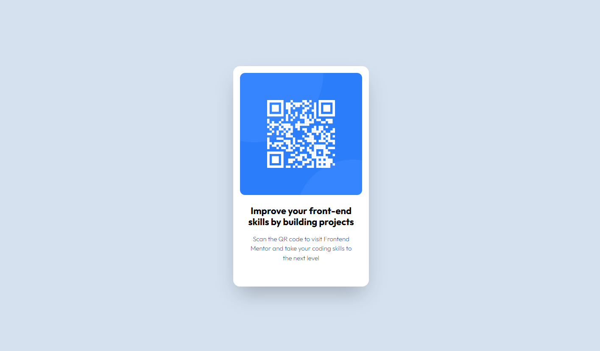

# Frontend Mentor - QR code component solution

This is a solution to the [QR code component challenge on Frontend Mentor](https://www.frontendmentor.io/challenges/qr-code-component-iux_sIO_H). Frontend Mentor challenges help you improve your coding skills by building realistic projects.

## Table of contents

- [Frontend Mentor - QR code component solution](#frontend-mentor---qr-code-component-solution)
  - [Table of contents](#table-of-contents)
  - [Overview](#overview)
    - [Screenshot](#screenshot)
    - [Links](#links)
  - [My process](#my-process)
    - [Built with](#built-with)
    - [What I learned](#what-i-learned)
    - [Continued development](#continued-development)
    - [Useful resources](#useful-resources)
  - [Author](#author)
  - [Acknowledgments](#acknowledgments)

## Overview

### Screenshot



### Links

- Solution URL: [Add solution URL here](https://github.com/Abdulrahman-Ka/qr-component)
- Live Site URL: [Add live site URL here](https://abdulrahman-ka.github.io/qr-component/)

## My process

### Built with

- Semantic HTML5 markup
- Tailwindcss v4.1
- CSS Flex
- [Google Fonts](https://fonts.google.com/) - For fonts

### What I learned

In this project, I focused on building a scalable styling architecture using Tailwind CSS v4. I implemented the project using the Play CDN and customized the @theme configuration to handle design tokens for specific typography presets and HSL colors. This approach allowed me to maintain high consistency across the mobile and desktop layouts while keeping the HTML clean and scannable.

To see how you can add code snippets, see below:

```html
<h2 class="text-preset-bold">
  Improve your front-end skills by building projects
</h2>
```

```css
@theme {
  --color-slate-900: #1f314f;
  --text-preset-bold--letter-spacing: 0px;
}
```

### Continued development

- Transitioning from CDN to Local Build Tools: While the Tailwind Play CDN was excellent for this quick component, I want to move toward a Vite or PostCSS setup in future projects. This will allow me to use the full power of Tailwind's CLI, minify my CSS for better performance, and explore the complete plugin ecosystem.

- Deepening Design Token Knowledge: I found the @theme configuration in Tailwind v4 incredibly powerful for maintaining consistency. I want to continue refining how I name and structure these tokens—especially for complex systems involving dark mode support and multi-font families.

### Useful resources

- [Tailwind CSS v4.0 Documentation](https://tailwindcss.com/docs/installation/play-cdn) - This was essential for understanding the new @theme and @utility syntax. It helped me move away from the old JavaScript-based configuration to a much cleaner CSS-first approach.

- [Google Fonts - Outfit -](https://fonts.google.com/specimen/Outfit) The specific typography for this challenge. I used this to practice importing external fonts and mapping them to Tailwind's --font-sans variable.

## Author

- Github - [AbdulRahman Kallas](https://github.com/Abdulrahman-Ka/)
- Frontend Mentor - [@Abdulrahman-Ka](https://www.frontendmentor.io/profile/Abdulrahman-Ka)
- Twitter - [@AbdrahmanKallas](https://www.twitter.com/AbdrahmanKallas)

## Acknowledgments

- Frontend Mentor - Huge thanks to the Frontend Mentor community for providing the professional design assets and the challenge that allowed me to practice my front-end skills.

- Tailwind CSS Team - For the incredible documentation on the new v4.0 engine, which made learning the new CSS-first configuration and @theme variables a smooth experience.

- Google Fonts - For providing the Outfit typeface that gives this project its modern and clean look.
